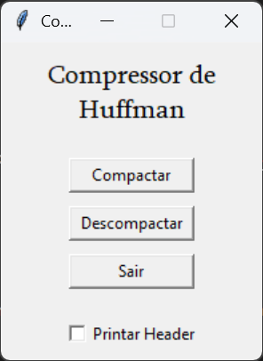
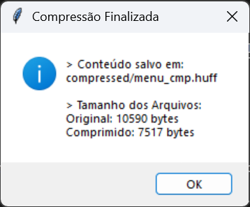
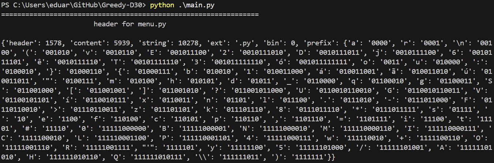

# Algoritmos Ambiciosos - *Compressor de Huffman*

## Sobre 

O *Compressor de Huffman* é um projeto desenvolvido pela [**Dupla 30**](#alunos) da disciplina de **Projeto de Algoritmos**, da *Universidade de Brasília (UnB/FCTE)*, para o módulo 3 (**Algoritmos Ambiciosos**). Para isso, foi construído um compressor de arquivos utilizando o *algoritmo de Huffman*, que se baseia na ideia da construção de prefixos para os caracteres de um texto, de modo a economizar espaço em disco na representação de bits, de acordo com a frequência de um elemento no texto. O projeto tem suporte às seguintes funcionalidades:

- **Compressão** de arquivos de texto (*Plain Text*) e de arquivos em formatos diversos para um binário **.huff**;
- **Descompressão** de arquivos gerados pela aplicação;
- Geração de um dicionário contendo informações do arquivo e os códigos prefixos (**Cabeçalho**);
- Compressão e descompressão sucessiva;

**Obs:** *a compressão utiliza códigos prefixos pra reduzir a quantidade de bits dos caracteres e adiciona o Cabeçalho (não codificado) antes do conteúdo codificado. Se o conteúdo do arquivo de origem for pequeno o suficiente ou for lido em binário, poderá haver aumento da quantidade de bytes, por causa da adição do Cabeçalho.* 

<br>

## Apresentação

Confira a apresentação do projeto pela [**dupla**](#alunos) no link: ***https://youtu.be/ft9hvGkDvJ4🔗***

<br>

## Screenshots

Abaixo, estão *screenshots* demonstrando um exemplo do funcionamento do sistema:

### *► Menu Principal*



### *► Menu Pós Compressão*



### *► Visualização do Cabeçalho Gerado*



<br>

## Requisitos
- **Linguagem**: *Python*
- **Bibliotecas**:
    - *tkinter* (nativa do *Python*)
    - *bitarray* (`pip install bitarray`)

<br>

## Instalação e Uso

1. Clone o repositório na pasta de sua preferência:

```bash
git clone https://github.com/projeto-de-algoritmos-2025/Greedy-D30
```

2. Navegue até a pasta :

```bash
cd Greedy-D30
```

3. Execute o arquivo *main.py*:

```bash
python main.py
```

<br>

## Alunos

| [](https://github.com/eduardodpms) | [](https://github.com/pedroeverton217) |
|:-:|:-:|
| [*Eduardo de Pina*](https://github.com/eduardodpms) | [*Pedro Everton*](https://github.com/pedroeverton217) |
| 23/1034494 | 22/1008768 |